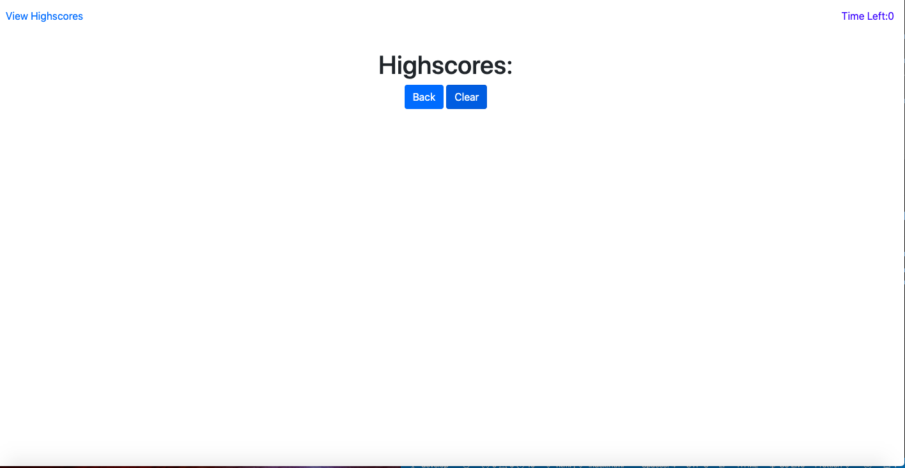

# JavaScript Code Quiz
## Description
This was a homework assignment from Georgia Tech Full-Stack Program. This application is a timed coding quiz and will feature dynamically updated HTML and CSS powered by JavaScript.It will also feature a clean and polished user interface and be responsive, ensuring that it adapts to multiple screen sizes.

Once user clicks start, timer will run and the answer feedback will be displayed as correct or wrong. If wrong timer get subtracted by 10 seconds. Quiz ends if timer reaches 0 or when last question is answered. The score recorded will be the time left. User can see results and save their initials in the highscore panel. User can take the quiz again by going back or clear their scores. 

## Table of Contents
* [Installation](#installation)
* [Usage](#usage)
* [Credits](#credits)
* [License](#license)
* [Contributing](#contributing)

## Installation
1. Clone the repo
2. Open index.html in default browser

## Usage
[Deployed Application]( https://sharonkim09.github.io/gt-hw-code-quiz/)

The following image demonstrates the application functionality:

My screenshots for the code quiz.

## Credits
This design was designed by the curriculum team. The instructions were provided to me by GT Full Stack Coding Program.

Credit to W3 schools for helping me understand concepts used in this application.

## License
MIT License

Copyright (c) [2020] [Sharon Kim]

Permission is hereby granted, free of charge, to any person obtaining a copy
of this software and associated documentation files (the "Software"), to deal
in the Software without restriction, including without limitation the rights
to use, copy, modify, merge, publish, distribute, sublicense, and/or sell
copies of the Software, and to permit persons to whom the Software is
furnished to do so, subject to the following conditions:

The above copyright notice and this permission notice shall be included in all
copies or substantial portions of the Software.

THE SOFTWARE IS PROVIDED "AS IS", WITHOUT WARRANTY OF ANY KIND, EXPRESS OR
IMPLIED, INCLUDING BUT NOT LIMITED TO THE WARRANTIES OF MERCHANTABILITY,
FITNESS FOR A PARTICULAR PURPOSE AND NONINFRINGEMENT. IN NO EVENT SHALL THE
AUTHORS OR COPYRIGHT HOLDERS BE LIABLE FOR ANY CLAIM, DAMAGES OR OTHER
LIABILITY, WHETHER IN AN ACTION OF CONTRACT, TORT OR OTHERWISE, ARISING FROM,
OUT OF OR IN CONNECTION WITH THE SOFTWARE OR THE USE OR OTHER DEALINGS IN THE
SOFTWARE.

---

## Contributing

We are not currently accepting contributors at the moment.
